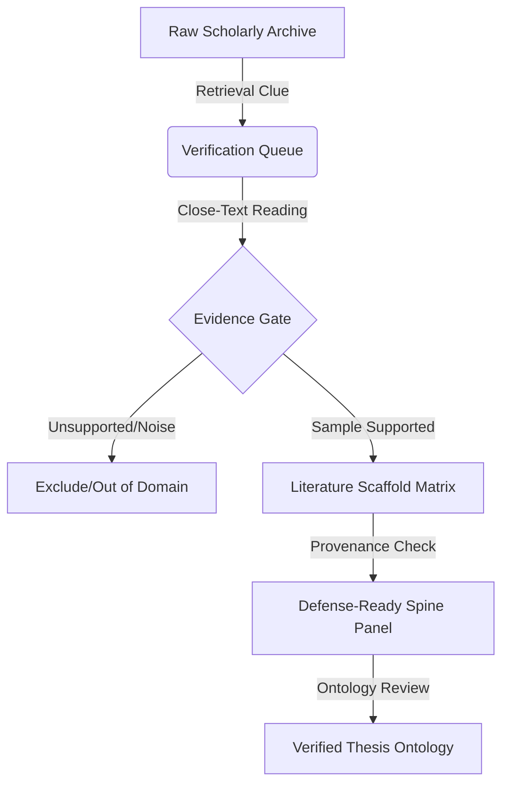

# KNOWLEDGE PRISM — PhD Research UX Enrichment Recommendations

**Author:** GitHub Copilot · **Model:** Gemini 3.5 Flash  
**Date:** 2026-07-09  
**Scope:** Read-Only Interface Research & Cognitive Mapping

---

## Executive Summary

A PhD student pursuing a doctorate in international relations, regional security, or political cartography faces unique challenges inside a dense, 35,000+ document archive. Their primary bottle-necks are **cognitive overload**, the difficult transition from raw data (**Layer A**) to theoretical structures (**Layer B**), and **scholarly provenance anxiety** (the fear of being unable to defend the exact source, page, or quotation of their findings during a dissertation defense).

To convert KNOWLEDGE_PRISM into a highly specialized academic exoskeleton, we recommend enriching the UX around five cognitive anchors:

1. **The Scaffold Visualizer:** A multi-layered diagram interface depicting the bridge between raw empirical readings and methodology.
2. **The Defense-Ready Spine Panel:** A sidepanel showing the exact ledger block, file hash, extraction date, and validation status of any active claim.
3. **The Literature Grid/Synthesis Matrix:** Transitioning the user from a simple search result list directly into a comparative matrix.
4. **OCR/Readability Remediator:** A visible health indicator that alerts students to unread, messy scanning, or OCR-dependent materials.
5. **Supervisor Handover mode:** Automatic assembly of audited blocks into structured, supervisor-admissible reports.

---

## 5 Core Pillars of PhD UX Enrichment

### Pillar 1: Transitioning from Search List to Literature Synthesis Matrix
* **The Current Experience:** The static fronts and Tkinter UI present search files as items or tables.
* **The PhD Bottleneck:** Systematic literature reviews require comparative analysis. Students need to see what *authors* say about the *same concept* side-by-side.
* **UX Recommendation:** Implement a "Literature Grid View." When a student queries key concepts like *“securitisation near abroad Russia”*, the interface should construct a dynamic matrix crossing candidate works against core theoretical and empirical intersections. 
* **Interactive Tooling:** Selecting cells allows the student to highlight, tag, and write inline functional-role prose immediately.

### Pillar 2: The Defense-Ready Provenance Panel (Anxiety Relief)
* **The Current Experience:** Hash codes and block linkages are stored in SQLite or static JSON logs.
* **The PhD Bottleneck:** The defense (viva) demands absolute traceability. If a reviewer asks: *"On what basis do you claim Dmitri Trenin's The End of Eurasia bridges geoeconomic semiotics and post-Soviet security?"* the student must not panic.
* **UX Recommendation:** A collapsible sidepanel attached to every node, document, and claim across the [interaction.html](interaction.html), [interface.html](interface.html), and [dashboard.html](dashboard.html) views. Clicking any claim exposes:
  * Canonical file sha256 checksum.
  * Verified verbatim quote (highlighted inside the target page).
  * Ledger Block Number (e.g., Block 25) with actor name and timestamps.
  * Evidence integrity seal (`chain_link_ok: true`).

### Pillar 3: Visual Dual-Layer Map (Layer A x Layer B)
* **The Current Experience:** The app displays a force-directed graph of concepts or a static lists.
* **The PhD Bottleneck:** The critical leap of a dissertation is linking geography to theory. Forces in a standard graph hide this structured divide.
* **UX Recommendation:** Adopt a **Bipartite/Two-Layer Layout**. Organize the canvas into two distinct horizontal or vertical tiers:
  * **Layer A (Empirical Base):** Specific region-anchored nodes (*Afghanistan, Uzbekistan, BRI corridors, Heartland*).
  * **Layer B (Theoretical Apparatus):** Conceptual nodes (*Regional Security Complex Theory, Critical Geopolitics, Cartographic Semiotics*).
  * **The Seam (Bridges):** Highlight the active intersecting edges. Selecting an intersection displays the live texts that *prove* the seam is academically active.

### Pillar 4: The Triage & Readability Workbench
* **The Current Experience:** Files are categorized as `not_read`, `ocr_required`, or `quote_validated`.
* **The PhD Bottleneck:** Old, non-indexed, or poorly scanned Russian, Soviet, or Central Asian documents are common. Spotting these early prevents wasted labor.
* **UX Recommendation:** Integrate a "Reading Health Dashboard" inside the desktop app. It scans target PDFs in the current queue and flags:
  * Low contrast or non-searchable PDF layers (automatic alert: `OCR required`).
  * Non-canonical duplicates (displays a visual diff of file size or metadata).
  * Active links to re-run OCR or submit extraction commands safely under human guidance.

### Pillar 5: Structured Supervisor Export Handover (Usability)
* **The Current Experience:** Reports are written to text files or simple local drafts under `outputs/gui_reports/`.
* **The PhD Bottleneck:** Students must regularly submit drafts, chapters, and progress logs to their research advisors.
* **UX Recommendation:** Implement a "Supervisor Export Brief." It compiles:
  1. The explicit research question.
  2. The generated query lens and Recoll queries (making the literature search reproducible).
  3. The current verification status of all sources.
  4. The generated functional-role interpretations and literature outlines formatted in standard academic styles (APA, Chicago, or Harvard).

---

## Pedagogic Map of the Knowledge Prism Exoskeleton

The following template outlines how these UX pillars enrich the transition from retrieval to doctoral writing:

| Stage | Activity | User Painpoint | UX Feature Solution | Outcome |
| :--- | :--- | :--- | :--- | :--- |
| **Stage 1 & 2** | Raw Exploration | Loss of context, duplicate chaos. | Smart grouping of duplicate chains + local path masking. | Tidy archive workspace. |
| **Stage 3 & 4** | Verification Queueing | Determining what to read first. | Anchor Indicator categories + interactive pre-sampling views. | Focused reading strategies. |
| **Stage 5 & 6** | Rubric Adjudication | Extracting quote proof manually. | Multi-column verification matrix (verbatim quotes x thesis validity). | Audit-ready database. |
| **Stage 7 & 8** | Synthesis & Writing | Drafting chapters from disjointed PDFs. | Bipartite ontological maps + supervisor document exports. | High-quality dissertation draft. |

---

## Conclusion

By introducing these features into the local TKinter tool and the safe preview browser, the PhD researcher transitions from a user struggling with a massive directory of files into a **scholarly editor** sitting at the command of an auditable, rigorous, and completely defensible research platform.
